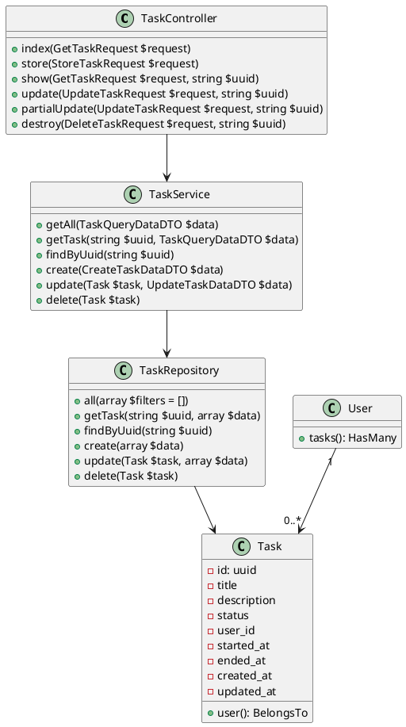
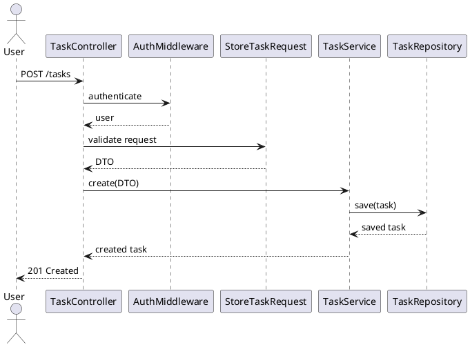

# User Stories - Task Management System

## Table of Contents

* [Introduction](#introduction)
* [Feature 1: Task Creation](#feature-1-task-creation)
* [Feature 2: Task Duplication (User Onboarding)](#feature-2-task-duplication-user-onboarding)

---

## Introduction

This document describes a Task Management System built with Laravel. It covers **task CRUD operations**, task duplication for new users, user stories, acceptance criteria, API endpoints, and UML diagrams (use case, class, sequence) to provide a developer-ready spec. Tasks include fields such as `title`, `description`, `status`, `started_at`, `ended_at`, and are associated with users.

---

## Feature 1: Task Creation

### User Story 1: Create a Task

**As an** authenticated user
**I want to** create a new task
**So that** I can keep track of work I need to do

#### Acceptance Criteria

* User must be authenticated
* Required fields: `title`
* Optional fields: `description`, `started_at`, `ended_at`
* Task is assigned to the authenticated user
* Task status defaults to `pending`
* Task is persisted in the database
* API returns the created task in structured JSON

#### UML Diagrams

**Use Case Diagram**

```planuml
@startuml
actor User
User --> (Create Task)
User --> (View Tasks)
User --> (Update Task)
User --> (Delete Task)
User --> (Mark Task Completed)
@enduml
```

**Class Diagram**



**Sequence Diagram**



---

### User Story 2: View My Tasks

**As an** authenticated user
**I want to** view my tasks
**So that** I can track my work

#### Acceptance Criteria

* Authenticated user only sees their tasks
* Tasks include `title`, `description`, `status`, `started_at`, `ended_at`
* Response format is consistent (API Resource)

---

### User Story 3: Update a Task

**As an** authenticated user
**I want to** update a task
**So that** I can edit title, description, or dates

#### Acceptance Criteria

* User can only update their own tasks
* Can modify `title`, `description`, `status`, `started_at`, `ended_at`
* Updates are persisted
* Response returns updated task

---

### User Story 4: Delete a Task

**As an** authenticated user
**I want to** delete a task
**So that** I can remove completed or unnecessary tasks

#### Acceptance Criteria

* User can only delete their own tasks
* Task is removed from database
* Response confirms deletion

---

### User Story 5: Mark Task Completed

**As an** authenticated user
**I want to** mark a task completed
**So that** I can track progress

#### Acceptance Criteria

* Only own tasks can be marked
* Status changes from `pending` → `completed`
* Updates are persisted
* Response returns updated task

---

## Feature 2: Task Duplication (User Onboarding)

### User Story 6: Create a User With Predefined Tasks

**As an** administrator
**I want to** create a new user and clone tasks from another user
**So that** the new user starts with predefined tasks

#### Acceptance Criteria

* Admin can specify `clone_from_user_id`
* Only eligible tasks are duplicated
* Duplicated tasks belong to the new user
* Original tasks remain unchanged

---

### User Story 7: Duplicate Only Active Tasks

**As an** administrator
**I want to** duplicate only pending tasks
**So that** completed tasks are excluded

#### Acceptance Criteria

* Only tasks with `pending` status are duplicated
* Logic is configurable
* New user receives relevant tasks
